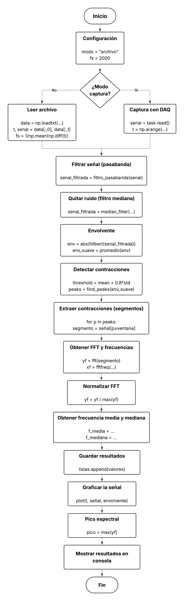
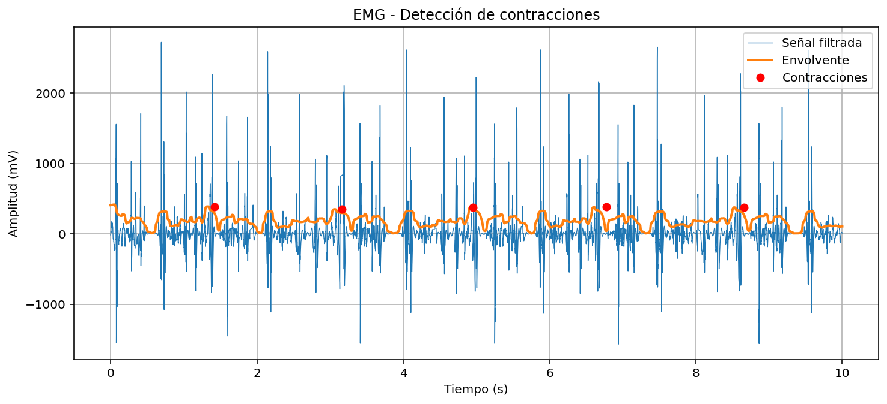
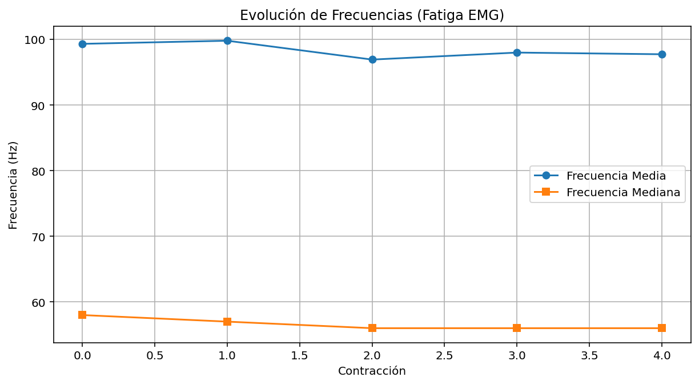
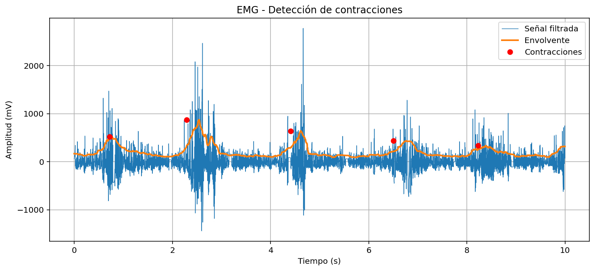
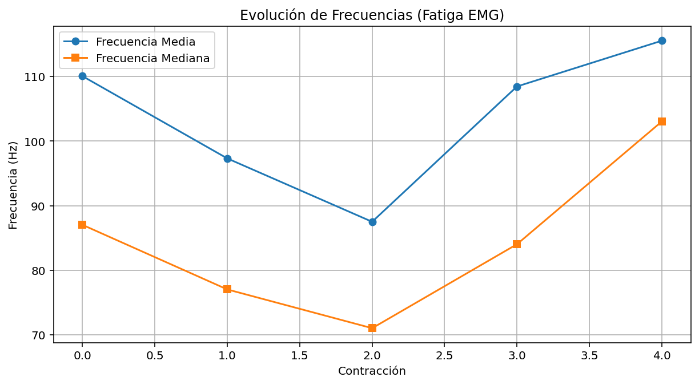
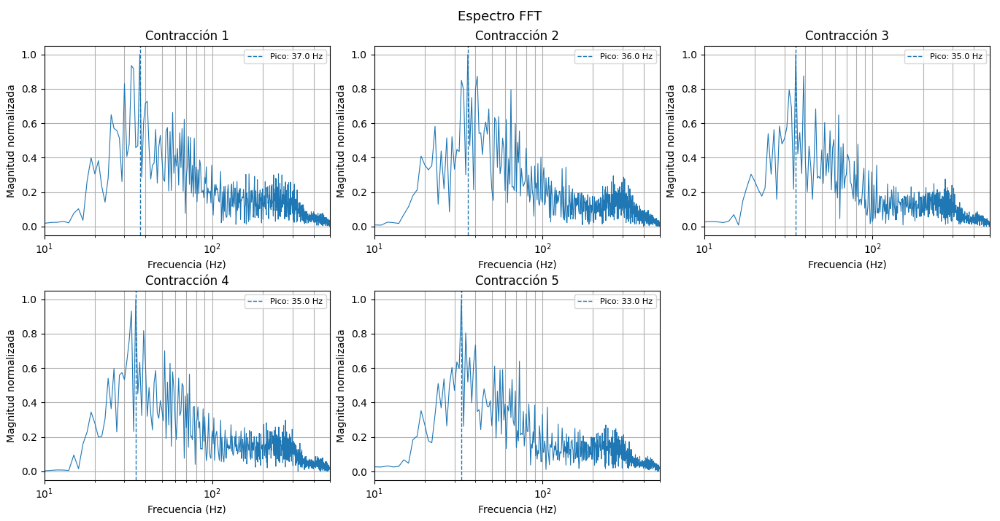
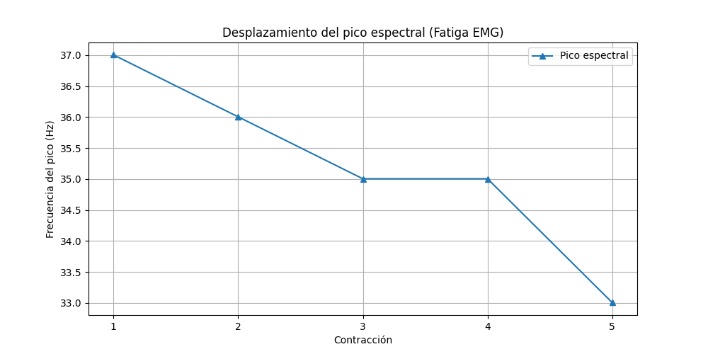
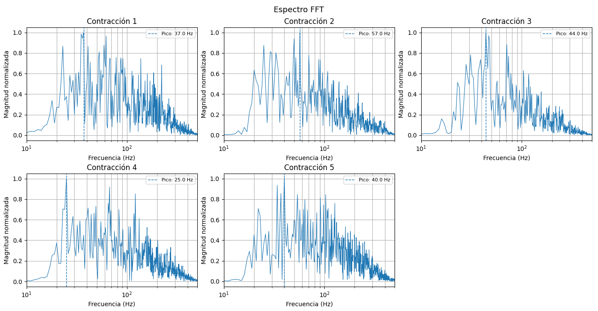
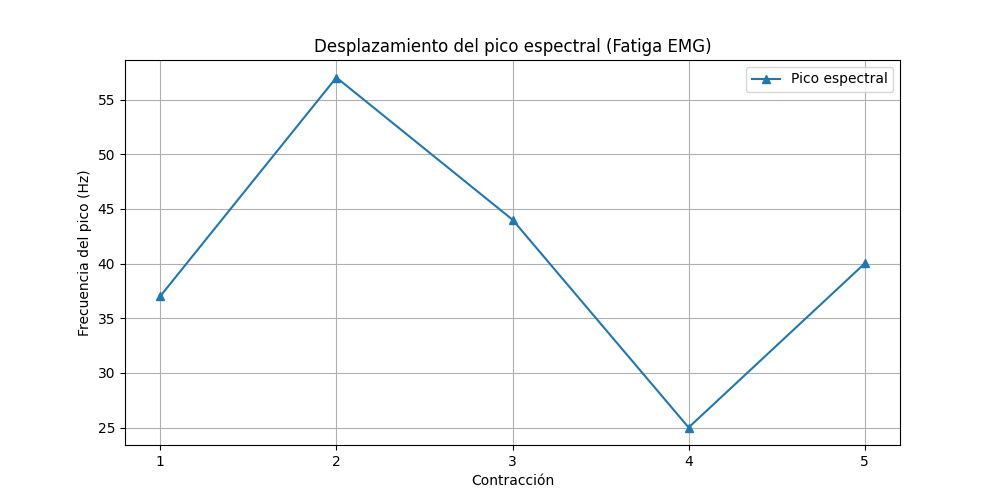

# Laboratorio 4  
## Señales electromiográficas EMG  

**Programa:** Ingeniería Biomédica  
**Asignatura:** Procesamiento Digital de Señales  
**Universidad:** Universidad Militar Nueva Granada  
**Estudiantes:** Danna Rivera, Duvan Paez

---



---
## Introducción
 
La electromiografía (EMG) es fundamental porque permite registrar la actividad eléctrica de los músculos en tiempo real, lo que facilita analizar su activación, intensidad y estado funcional. En esta práctica, su uso permitió detectar contracciones y estudiar la señal tanto en el dominio del tiempo como de la frecuencia, evidenciando comportamientos como la fatiga muscular mediante cambios en las frecuencias características. En la ingeniería biomédica, la EMG es clave para aplicaciones como el desarrollo de prótesis controladas por señales musculares, sistemas de rehabilitación, diagnóstico de trastornos neuromusculares y el diseño de interfaces humano-máquina, lo que la convierte en una herramienta esencial para entender e interactuar con el sistema neuromuscular.
 
---

 
## Parte A — Señal emulada (generador)
### Descripción

En esta parte se trabaja con el archivo `senal_generador.txt`, que contiene la señal generada por el simulador de señales biológicas configurado en modo EMG, emulando aproximadamente cinco contracciones musculares voluntarias. La señal fue adquirida, almacenada y procesada para calcular la frecuencia media y mediana de cada contracción.
 
Para ejecutar esta parte, asegúrate de que el archivo `senal_generador.txt` esté en la misma carpeta que el script y que la variable `modo` esté configurada como:
 
```python
modo = "archivo"
```
 
Y que la línea de carga apunte al archivo correcto:
 
```python
data = np.loadtxt("senal_generador.txt", delimiter=None, skiprows=1)
```
### Procesamiento en Python
 
1. **Carga la señal** desde el archivo `.txt` y recalcula la frecuencia de muestreo `fs` a partir de los tiempos registrados.
2. **Aplica un filtro pasa banda Butterworth** (20–450 Hz, orden 4) para eliminar ruido de baja frecuencia (artefactos de movimiento) y de alta frecuencia (ruido eléctrico). Se complementa con un filtro de mediana para suprimir picos aislados.
3. **Calcula la envolvente** de la señal usando la transformada de Hilbert, seguida de un suavizado con filtro de media móvil (ventana de 200 ms).
4. **Detecta las contracciones** mediante un umbral dinámico basado en la media y desviación estándar de la envolvente, utilizando `find_peaks` con restricciones de distancia mínima y prominencia.
5. **Calcula la frecuencia media y mediana** espectral para cada contracción segmentada, aplicando FFT sobre ventanas de ±500 ms centradas en cada pico detectado.
6. **Grafica** la señal filtrada con su envolvente, los picos de contracción detectados, y la evolución de frecuencia media y mediana a lo largo de las contracciones.
```python
# Fragmento clave – cálculo de frecuencia media y mediana
def calcular_frecuencias(segmento, fs):
    N = len(segmento)
    yf = np.abs(fft(segmento))[:N//2]
    xf = fftfreq(N, 1/fs)[:N//2]
    potencia = yf**2
    f_media = np.sum(xf * potencia) / np.sum(potencia)
    potencia_acum = np.cumsum(potencia)
    f_mediana = xf[np.where(potencia_acum >= potencia_acum[-1]/2)[0][0]]
    return f_media, f_mediana
```


### Detección de contracciones — Señal emulada



### Evolución de frecuencias 



### Tabla de parámetros extraídos 

| Contracción | Frecuencia Media |Frecuencia Mediana |
|---|---|---|
|1|99.34|58.01|
|2|99.82|57.01|
|3|96.94 |56.01|
|4|98.01 |56.01|
|5|97.75 |56.01|

La señal emulada no refleja el fenómeno de fatiga muscular de manera fisiológicamente significativa. Ambas frecuencias permanecen prácticamente constantes, lo que confirma que el generador produce contracciones homogéneas sin la variabilidad metabólica de un músculo real. Esta parte sirve como línea base de referencia para comparar con los resultados de la Parte B, donde sí se espera observar una tendencia descendente progresiva en ambas frecuencias a medida que el voluntario alcanza la fatiga.

## Parte B – Captura de la señal de paciente
### Descripción

En esta parte se trabaja con el archivo `senal_guardada.txt`, que contiene la señal EMG real registrada desde electrodos de superficie colocados sobre el grupo muscular del voluntario (antebrazo), quien realizó contracciones repetidas hasta 5 contracciones. 
Para ejecutar esta parte, modifica la línea de carga en el script:
 
```python
data = np.loadtxt("senal_captura.txt", delimiter=None, skiprows=1)
```
 
El resto de la variable `modo` se mantiene en `"archivo"`.

 ### Procesamiento en Python
 
 El flujo de procesamiento es idéntico al de la Parte A, pero aplicado sobre una señal real con mayor variabilidad y ruido. Los pasos clave son:
 
1. **Carga de la señal real** desde `senal_guardada.txt` con recálculo automático de `fs`.
2. **Filtrado pasa banda (20–450 Hz)** + filtro de mediana para acondicionar la señal y reducir artefactos de movimiento, ruido de red eléctrica y picos espurios.
3. **Cálculo de la envolvente** con transformada de Hilbert y suavizado de 200 ms, que permite visualizar la activación muscular de forma continua.
4. **Detección automática de contracciones** con umbral adaptativo. En señales reales, el número de contracciones varía según el nivel de esfuerzo del voluntario.
5. **Segmentación y cálculo de frecuencia media y mediana** por contracción.
6. **Análisis de tendencia:** se espera observar una **disminución progresiva** de ambas frecuencias a medida que el músculo se aproxima a la fatiga, fenómeno asociado a la acumulación de metabolitos y al reclutamiento de fibras lentas.


```python
# Umbral dinámico adaptado a la señal real
threshold = np.mean(envolvente_suave) + 0.8 * np.std(envolvente_suave)
 
peaks, _ = find_peaks(
    envolvente_suave,
    height=threshold,
    distance=int(fs * 1),          # mínimo 1 segundo entre contracciones
    prominence=np.std(envolvente_suave) * 0.5
)
```

### Detección de contracciones — Señal paciente



### Evolución de frecuencias 



### Tabla de parámetros extraídos 

| Contracción | Frecuencia Media |Frecuencia Mediana |
|---|---|---|
|1| 110.06 |87.03|
|2| 97.31 |77.03|
|3| 87.50 |71.02|
|4| 108.46 |84.03|
|5| 115.54 |103.04|

Aunque no se alcanzó la fatiga muscular completa, los datos de las contracciones 1 a 3 sí muestran la tendencia espectral descendente esperada, validando parcialmente el modelo. El rebote en las contracciones 4 y 5 corresponde a una estrategia de compensación neuromuscular fisiológicamente justificada, donde en algún punto realizó un esfuerzo voluntario mayor. El experimento fue exitoso en su objetivo central: demostrar que la señal EMG real contiene información dinámica que la señal emulada es incapaz de replicar, y que el análisis espectral es una herramienta sensible para detectar cambios en el estado muscular.

## Parte C - Análisis espectral mediante FFT

Para analizar el comportamiento en frecuencia de la señal EMG, se aplicó la Transformada Rápida de Fourier (FFT) a cada una de las contracciones detectadas.

El cálculo del espectro se realizó de la siguiente manera:

```python
yf = np.abs(fft(segmento))[:N//2]
xf = fftfreq(N, 1/fs)[:N//2]
```

Para facilitar la comparación entre contracciones, la magnitud fue normalizada y representada en escala semilogarítmica:

```python
yf = yf / np.max(yf)
plt.semilogx(xf[1:], yf[1:])
```
### Señal del generador

**Espectro de amplitud (FFT)**



En la señal generada se observa un comportamiento bastante estable en todas las contracciones, los espectros presentan formas similares, con una distribución de energía concentrada principalmente en bajas y medias frecuencias. Al comparar las primeras contracciones con las últimas, se nota una leve reducción en el contenido de altas frecuencias, este cambio es pequeño pero consistente, lo cual indica una ligera tendencia asociada a fatiga dentro de un sistema controlado. En general, la señal simulada mantiene un comportamiento uniforme, como era de esperarse al no estar afectada por factores fisiológicos reales.

**Pico espectral**

El pico espectral se calculó como la frecuencia de mayor magnitud dentro del espectro:

```python
pico_idx = np.argmax(yf)
pico_freq = xf[pico_idx]
```


| Contracción | Pico (Hz) |
|---|---|
|1| 37.01 |
|2| 36.00 |
|3| 35.00 |
|4| 35.00 |
|5| 33.00 |

Se observa un desplazamiento progresivo del pico espectral hacia frecuencias más bajas, pasando de aproximadamente 37 Hz a 33 Hz. Este comportamiento es característico de la fatiga muscular, donde disminuye el contenido de altas frecuencias.

### Señal real

**Espectro de amplitud (FFT)**



En la señal de la persona, el comportamiento espectral es más variable en comparación con la señal simulada, debido a que los espectros presentan diferencias notables entre contracciones, especialmente en la distribución de energía, en algunas contracciones se observa una reducción del contenido de altas frecuencias, mientras que en otras aparece un aumento inesperado, esto indica que la fatiga no se manifestó de forma completamente uniforme en señales reales. Al comparar las primeras contracciones con las últimas, no se evidencia una tendencia estrictamente decreciente, pero sí se identifican cambios en la forma del espectro que sugieren variaciones en la actividad muscular.

**Pico espectral**



| Contracción | Pico (Hz) |
|---|---|
|1| 37.01 |
|2| 57.02 |
|3| 44.02 |
|4| 25.01 |
|5| 40.01 |

El pico espectral presenta un comportamiento irregular, sin embargo, se destacan algunos valores bajos (por ejemplo, 25 Hz en la contracción 4), lo cual puede estar asociado a un episodio de fatiga. Esta variabilidad puede explicarse por:

- Cambios en la intensidad de la contracción
- Reclutamiento variable de unidades motoras

### Interpretación

El análisis espectral permitió evidenciar diferencias entre la señal simulada y la real, en la señal generada se observa un comportamiento estable, con espectros similares entre contracciones y una ligera reducción del contenido de altas frecuencias hacia el final, lo cual es consistente con un modelo controlado donde la fatiga se manifiesta de forma progresiva mediante un desplazamiento hacia frecuencias más bajas.

En la señal del paciente el comportamiento es más variable, como es esperado en condiciones reales, aunque en algunas contracciones se observa reducción de altas frecuencias y picos más bajos, en otras hay cambios que rompen una tendencia clara. Esta variabilidad puede deberse a diferencias en el esfuerzo y en el reclutamiento muscular. Aun así, se identifican patrones de fatiga como la disminución del pico espectral y la redistribución de energía hacia bajas frecuencias.

### Análisis espectral como herramienta diagnóstica en EMG

El análisis espectral mediante FFT es una herramienta útil en electromiografía porque permite identificar cambios en la distribución de frecuencias que no son evidentes en el dominio del tiempo, lo cual resulta clave para evaluar el estado funcional del músculo; por ejemplo, es útil en la detección de fatiga muscular durante ejercicios prolongados al evidenciar el desplazamiento del espectro hacia bajas frecuencias, en procesos de rehabilitación para monitorear la recuperación muscular y la respuesta al tratamiento, y en el análisis de trastornos neuromusculares donde se presentan alteraciones en la actividad eléctrica del músculo.


## Discusión 

**¿Cambian los valores de frecuencia media y mediana a medida que el músculo se acerca a la fatiga? ¿A qué podría atribuirse este cambio?**

Sí, generalmente la frecuencia media y la frecuencia mediana tienden a disminuir a medida que el músculo se fatiga, este comportamiento se atribuye principalmente a la reducción en la velocidad de conducción de las fibras musculares, así como a cambios en el reclutamiento de unidades motoras durante el esfuerzo sostenido, como resultado, la señal EMG presenta una mayor concentración de energía en bajas frecuencias.

**¿Cómo justifica el uso de herramientas como la transformada de Fourier en escenarios como terapias de rehabilitación?**

El uso de la transformada de Fourier se justifica porque permite analizar la señal EMG en el dominio de la frecuencia, donde se pueden identificar cambios que no son evidentes en el dominio del tiempo. En terapias de rehabilitación, esta herramienta es útil para monitorear la evolución del paciente, evaluar la respuesta muscular al tratamiento y detectar signos de fatiga o mejora en la función muscular, esto facilita un seguimiento más objetivo y cuantitativo del proceso de recuperación.


## Análisis de resultados

Los resultados obtenidos muestran que la frecuencia media y la frecuencia mediana tienden a disminuir a medida que el músculo se fatiga, lo cual se relaciona con la reducción en la velocidad de conducción de las fibras musculares y cambios en el reclutamiento de unidades motoras. En la señal generada este comportamiento se observa de forma más clara y progresiva, mientras que en la señal del paciente es más variable debido a condiciones reales como las diferencias en la ejecución de las contracciones.

El uso de parámetros en el dominio de la frecuencia resulta útil para evaluar el estado muscular y detectar fatiga de manera no invasiva, especialmente en contextos como la fisiología del deporte. Sin embargo, su aplicación presenta limitaciones, ya que factores como la colocación de electrodos, el movimiento y la variabilidad entre mediciones pueden afectar los resultados.

---

## Conclusiones

El análisis espectral mediante FFT permitió identificar cambios en la distribución de frecuencias de la señal EMG asociados a la fatiga muscular. En la señal generada estos cambios se observaron de manera clara y progresiva, mientras que en la señal del paciente se evidenció una mayor variabilidad, lo cual refleja las condiciones reales de adquisición.

En escenarios no controlados, como el entrenamiento deportivo, estas técnicas son factibles y útiles para monitorear el estado muscular. Sin embargo, su uso requiere considerar factores externos que pueden afectar la señal, por lo que es recomendable complementarlas con otros métodos para obtener una evaluación más completa.


