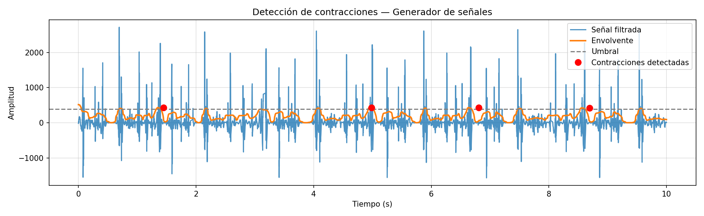

# Laboratorio 4  
## Señales electromiográficas EMG  

**Programa:** Ingeniería Biomédica  
**Asignatura:** Procesamiento Digital de Señales  
**Universidad:** Universidad Militar Nueva Granada  
**Estudiantes:** Danna Rivera, Duvan Paez

---

## Introducción
 
La electromiografía (EMG) es fundamental porque permite registrar la actividad eléctrica de los músculos en tiempo real, lo que facilita analizar su activación, intensidad y estado funcional. En esta práctica, su uso permitió detectar contracciones y estudiar la señal tanto en el dominio del tiempo como de la frecuencia, evidenciando comportamientos como la fatiga muscular mediante cambios en las frecuencias características. En la ingeniería biomédica, la EMG es clave para aplicaciones como el desarrollo de prótesis controladas por señales musculares, sistemas de rehabilitación, diagnóstico de trastornos neuromusculares y el diseño de interfaces humano-máquina, lo que la convierte en una herramienta esencial para entender e interactuar con el sistema neuromuscular.
 
---

 
## Parte A — Señal emulada (generador)
### Descripción
 
Se configuró el generador de señales biológicas en modo EMG, simulando aproximadamente
cinco contracciones musculares voluntarias. La señal fue adquirida, almacenada y procesada
para calcular la frecuencia media y mediana de cada contracción.

> Asegúrese de que los archivos `senal_cap_gen.txt` y `senal_cap.txt` estén en el mismo
> directorio que el script, o ajuste la ruta en la variable `ARCHIVOS` al inicio del código.

### Procesamiento en Python
 

  

### Detección de contracciones — Señal emulada

 
